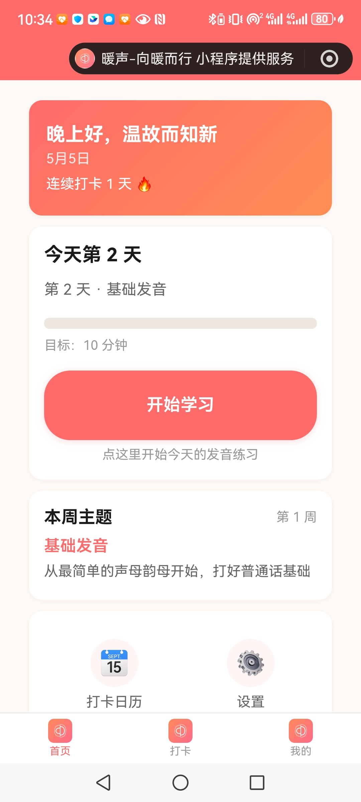
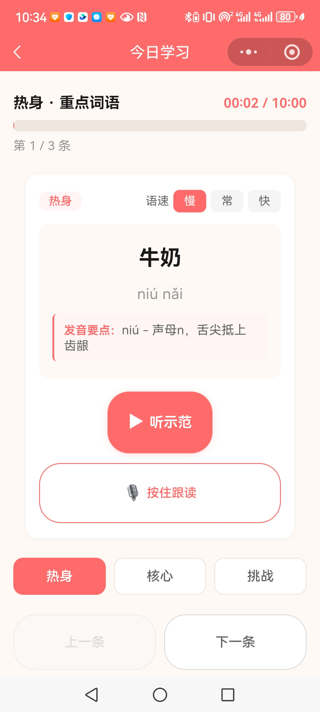
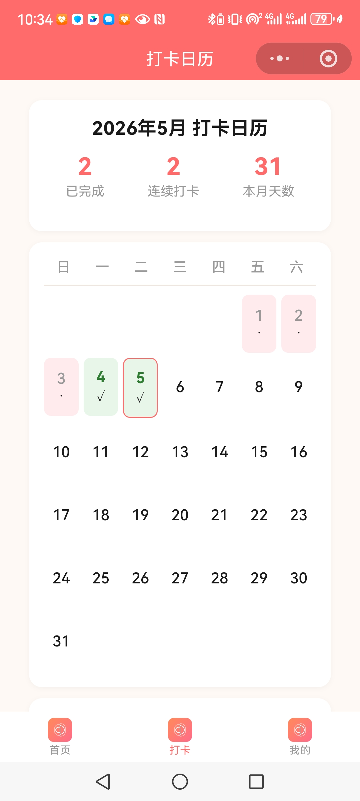
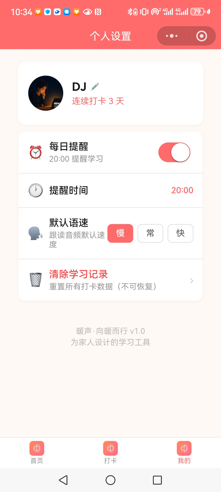
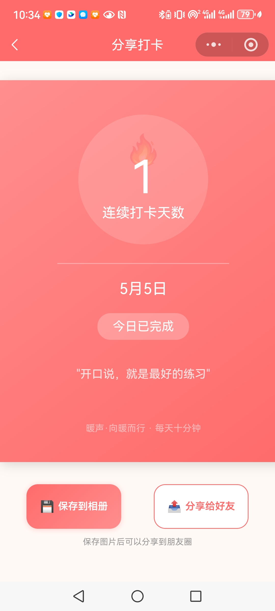

# 暖声·向暖而行

> 面向中老年用户的普通话学习微信小程序。50天系统化课程，每天10分钟，通过"热身→核心→挑战"三段式学习，帮助纠正方言发音、建立普通话自信。

## 技术栈

| 层级 | 技术 | 版本 |
|------|------|------|
| 小程序框架 | 微信原生小程序 | 基础库 3.15.2 |
| 前端 | WXML / WXSS / JavaScript (ES6) | — |
| 后端 | ~~微信云开发（云函数 + 数据库）~~ → **已切换纯本地模式** | wx-server-sdk latest |
| 数据持久化 | `wx.getStorageSync` 本地存储 | — |
| TTS 生成 | Microsoft Edge TTS | `edge-tts >= 7.2.8` |
| CDN 加速 | jsDelivr (GitHub 仓库分发) | — |
| 音频播放 | 微信 `InnerAudioContext` + 本地文件缓存 | — |
| Python 工具链 | uv + asyncio 并发批量生成 | Python >= 3.13 |
| 开发环境 | 微信开发者工具 + Node.js >= 16 | — |

## 技术方案

- **前端页面开发**：6个核心页面的 WXML 结构 + WXSS 样式 + JS 交互逻辑
  - `index` 首页（今日学习入口、连续打卡展示）
  - `learn` 学习页（三段式课程、变速播放、录音对比、进度追踪）
  - `calendar` 打卡日历（月视图、历史回溯）
  - `dashboard` 数据看板（连续天数、周进度、月度柱状图）
  - `profile` 个人中心（资料编辑、清除进度）
  - `share` 分享页（打卡海报生成、保存相册）
- **后端数据架构设计**：
  - 50天课程内容数据结构规划（`contents.js`：含文本、拼音、发音要点、音频URL）
  - 本地学习记录存储 Schema 设计（进度、日期、完成状态、分段统计）

- **音频架构设计与工具链开发**：
  - TTS 方案选型与三次迭代（微信云 TTS → 百度 TTS → edge-tts 预生成）
  - `scripts/tts-generator/` 工具链：批量生成 MP3 + 按周分组 + 自动注入 `audioUrl`
  - CDN 托管 + 本地缓存双层策略：首次 jsDelivr 下载，后续 `wx.env.USER_DATA_PATH` 秒播
- **性能与降级策略**：云开发不可用时自动切换本地模式，保证零依赖运行

## 如何体验

> 小程序尚未正式发布，如需体验请微信联系作者添加体验权限。
>
> 搜索体验版：**暖声·向暖而行**

### 页面截图

| 首页 | 学习页 |
|:---:|:---:|
|  |  |
| *今日学习入口、连续打卡* | *三段式课程、播放控制* |

| 打卡日历 | 个人信息 | 分享海报 |
|:---:|:---:|:---:|
|  |  |  |
| *月视图、学习记录* | *资料编辑、学习设置* | *打卡成果、励志语录* |

## 核心功能

- **三段式学习**：热身(2分钟/0.8x慢速) → 核心(5分钟/1.0x常速) → 挑战(3分钟/1.2x快速)
- **标准发音音频**：edge-tts 预合成，jsDelivr CDN 分发，首次加载后本地缓存秒播
- **录音对比**：录制自己的发音并与标准音频回听对比，辅助纠音
- **打卡日历**：月视图直观展示学习记录，支持历史回溯
- **学习看板**：连续打卡天数、周进度、月度统计、最近7次记录

- **分享海报**：生成打卡海报，分享朋友圈
- **离线可用**：纯本地模式，无需后端，卸载即清除数据

## 项目结构

```
mandarin_app_v2_ui_elder/
├── miniprogram/                  # 小程序主目录
│   ├── pages/                    # 6个核心页面
│   ├── data/contents.js          # 50天课程数据
│   ├── utils/                    # 工具函数
│   ├── images/                   # 静态资源
│   ├── audio-pkg-{a,b,c,d}/      # 音频资源（按周分组）
│   ├── app.js / app.json / app.wxss
│   └── cloudfunctions/           # 云函数（已停用，保留备用）
├── scripts/tts-generator/        # 音频生成工具链
│   ├── generate_all.py           # 批量生成 MP3（断点续传）
│   ├── migrate_audio.py          # 按周分组 + 自动更新 contents.js
│   ├── patch_contents.js         # 注入 audioUrl
│   └── pyproject.toml            # uv 依赖配置
└── project.config.json           # 项目配置（基础库 3.15.2）
```

## 音频生成工具链

```bash
cd scripts/tts-generator

# 1. 安装依赖
uv sync

# 2. 批量生成全部 MP3（支持断点续传）
uv run python generate_all.py

# 3. 按周分组移入音频目录，并自动更新 contents.js
uv run python migrate_audio.py
```

## 开发环境

1. 克隆项目，用**微信开发者工具**导入项目根目录
2. `app.js` 已配置为纯本地模式，无需云开发环境即可完整运行
3. 如需重新启用云开发，取消 `app.js` 中的本地模式注释并配置环境 ID

## 复盘与反思

| 时间线 | Commit | 学到的经验 |
|--------|--------|-----------|
| 早期 | `ff46db6` 开启云开发 TTS → `d05166d` 尝试 backgroundAudioManager | **不要过度依赖平台能力**。微信云 TTS 并发受限、稳定性差，平台能力随时可能调整 |
| 迭代期 | `0f5608b` edge-tts 预生成 mp3 + 微信分包 → `137f91a` 改用 jsDelivr CDN | **架构设计要考虑平台限制**。微信小程序分包有音频大小限制，InnerAudioContext 无法播放分包内音频，被迫换用 CDN 方案 |
| 优化期 | `99ef18b` 音频本地缓存，首次走 CDN、后续秒播 | **用户体验 = 网络请求次数 × 等待时间**。离线缓存不仅省流量，更消除了播放等待的焦虑感 |
| 稳定期 | `f53852c` 移除无效云函数调用 → `4ef890d` 关闭云开发，切换纯本地模式 | **简单优于复杂**。云开发增加了部署依赖和维护成本，对于纯个人数据的小程序，本地存储足够且更可靠 |
| 代码质量 | `06db907` 精简页面代码，移除冗余逻辑 | **警惕"数据泥团"和冗余**。中老年用户界面不需要复杂动效，代码应该和产品一样克制 |

### 关键反思

1. **TTS 方案三次迭代的教训**：从"运行时调用 API"到"预生成 + CDN + 本地缓存"的转变，本质是**将运行时风险转移到构建时**。edge-tts 本地批量生成一次，后续零成本播放，这是对此类静态内容最优的架构决策。

2. **云开发关闭的决策**：云开发确实降低了初期开发门槛，但带来了环境配置、部署流程、调用超时等隐性成本。当产品数据完全可以本地闭环时，**果断去掉后端依赖**是正确的。

3. **面向中老年用户的交互设计**：大字号、高对比度配色、极简操作流程、无网络也能用——这些不是"降级"，而是**针对目标用户的精准设计**。在 `dashboard` 和 `share` 页面的反复打磨中，理解了"克制"的重要性。
